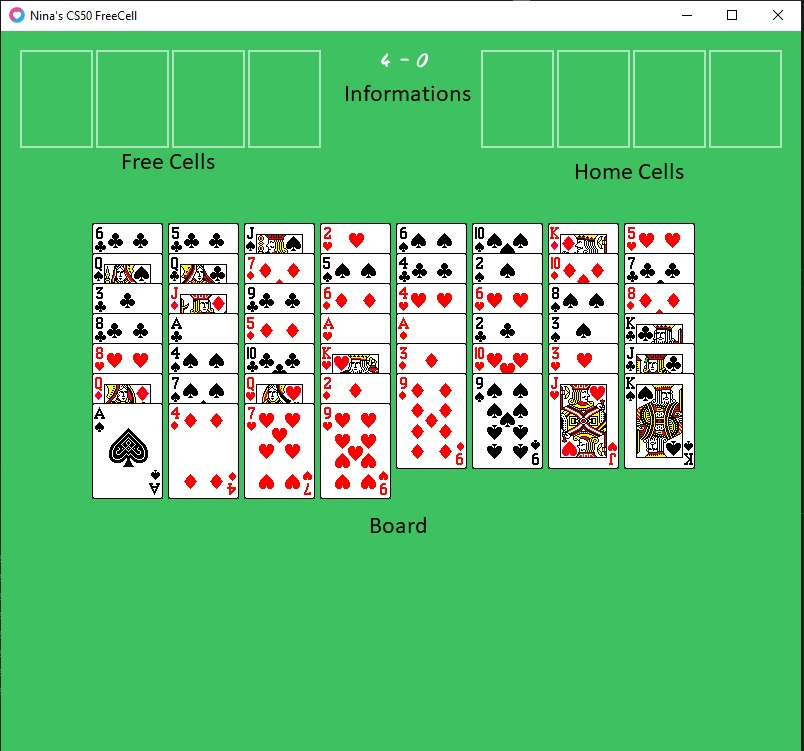
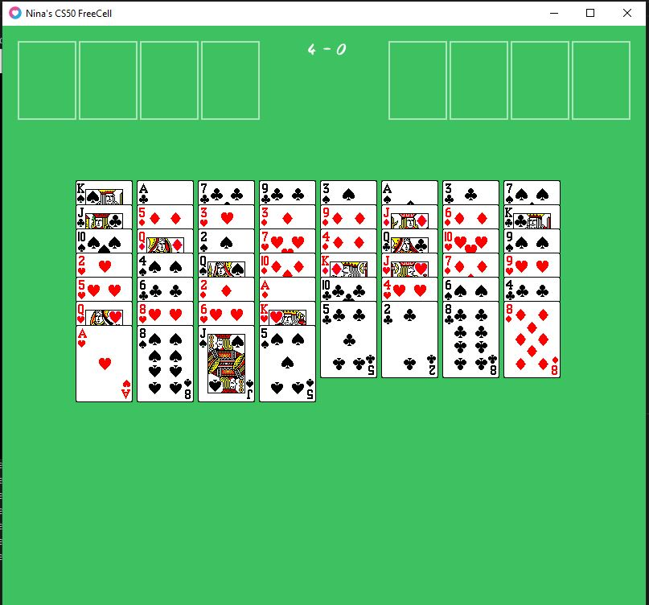
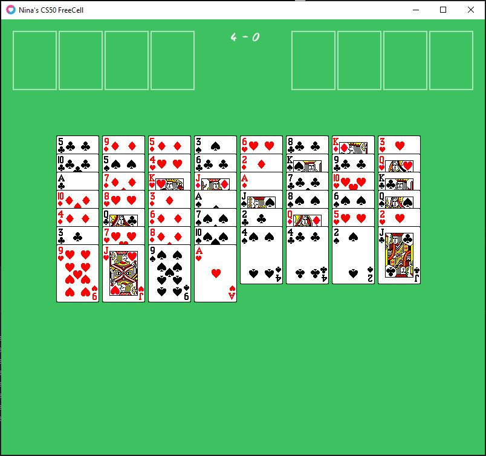
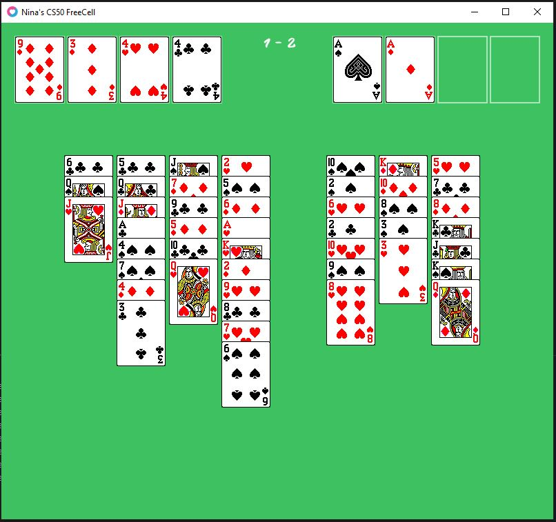
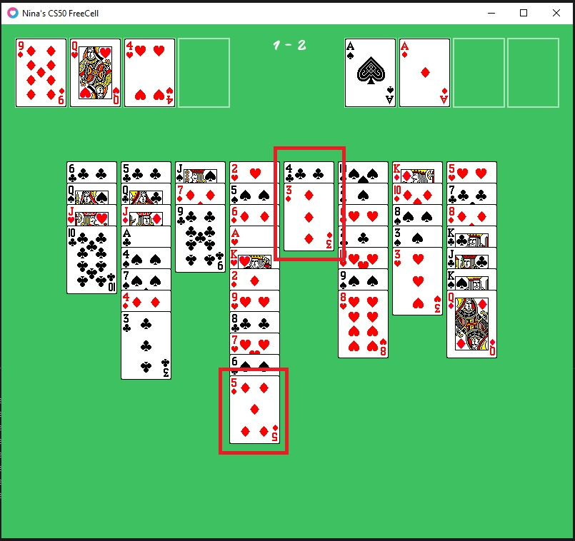
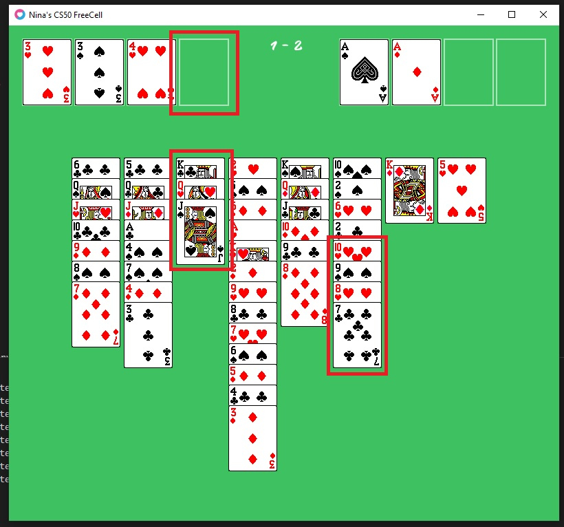
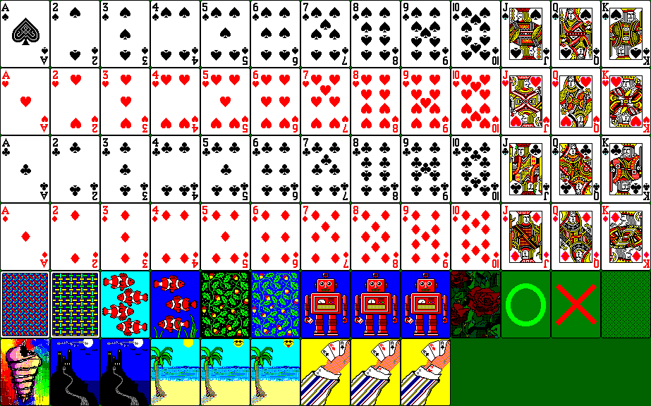

# CS50x's final project : FreeCell

## Introduction

### CS50x

CS50x is an online course proposed by HarvardX, available on the edX's platform.
Harvard University offers free online courses, as CS50x, which is an
>introduction to the intellectual enterprises of computer science and the art of programming. This course teaches students how to think algorithmically and solve problems efficiently. Topics include abstraction, algorithms, data structures, encapsulation, resource management, security, and software engineering. Languages include C, Python, and SQL plus students’ choice of: HTML, CSS, and JavaScript (for web development); Java or Swift (for mobile app development); or Lua (for game development). Problem sets inspired by the arts, humanities, social sciences, and sciences. Course culminates in a final project. 

For more information see :
* [CS50x on edX](https://courses.edx.org/courses/course-v1:HarvardX+CS50+X/course/)
* [HarvardX on edX](https://www.edx.org/school/harvardx)
* [CS50x](https://cs50.harvard.edu/x/2020/)
* [CS50x's final project](https://cs50.harvard.edu/x/2020/project/)

### FreeCell for computer

FreeCell is a patience card game played using a 52-card deck, for it's [rules](#Rules). 

The FreeCell game was first implemented for computers in 1978 for the PLATO computer system (see [PLATO](https://en.wikipedia.org/wiki/PLATO_(computer_system))), and has been included in most Windows operating system since 1995, which is the cause of it's popularity.

Until 2006 (Microsoft Vista), the Microsoft FreeCell was limited in it's player assistance features, such as retraction of moves. After 2006, the game offered basic hints and unlimited move retraction, and the option to restart the game.

According to Microsoft's telemetry, FreeCell was the seventh most-used Windows program.

The version of FreeCell I propose [here](https://github.com/ncaparros/FreeCell) is a basic implementation of that very popular solitaire game. My goal was to have a functional program observing all the [rules](#Rules) in order to practice :
* Implementing [Lua](#Lua)'s programming language
* Developing a full game [logic](#Structures) 
* Working with [objects](#Classes)
* Working with [sprites](#Sprites)
* Working with [nodes](#Nodes)

### Lua

[Lua](https://www.lua.org/about.html) is a free, open-source, lightweight, high-level, cross-platform programming language created in 1993. It supports amongst other object-oriented programming, which is extremely convenient for game developing.

### Löve

[Löve](https://love2d.org/) is a free, open-source, cross-platform engine used to make 2D games in [Lua](#Lua). It is designed in C++ and frequently used in video game development competitions.

## Rules

The game is composed of :
* Four open foundations (called Home Cells here)
* Four open cells (called Free Cells here)
* A board

All cards are randomly dealt face-up from at the begining of the game into eight cascades, half of them composed by seven cards, the other half by six, on the board. 

The goal is form full suits in order (starting with ace, ending with king) into open foundations (called "Home Cells" here). 

The player is allowed to build tableaux on the board, alternating colors and decreasing the card value by one as he goes.

Examples of valid tableaux :
* 1. King of spades
    2. Queen of hearts
    3. Jack of clubs
    4. Ten of diamonds
    5. Nine of clubs
    6. End of tableau
 
 

* 1. Six of spades
    2. Five of diamonds
    3. Four of spades
    4. Three of hearts
    5. End of tableau

Cards may be stored on open cells (one and only card on one open cell).

When a pile of cards on the board is empty, it becomes an open cell and cards can be stacked back on it.

Technically, the player is only allowed to move cards one by one, but to simplify the game experience, it is possible to move as many cards on a tableau as there are free cells plus one.
Examples : 
* If there is no free open cell, cards must be moved one by one
* If there is one open cell, cards may be moved two by two (if in tableau)
    * It is the equivalent of moving top card to free cell, then second card to destination, and moving back top card on second card
* If there is one open cell and one empty pile on the board, cards may be moved three by three
    * It is the same as having two empty open cells
    * It is the equivalent of moving top card to free cell, second card to empty pile, third card to destination, second card on third card, and top card back on second card

The game is won when all the cards are stack in suits in the foundation cells.

Not all deals are solvable.

## Features

### Random deal

Every deal is unique. There are 52 factorial () possible combinations. This is managed by using a custom class Deck which is mixing the cards during the initialization.

Here are two deal examples :

### Informations

The game displays the number of free cells (open cells and empty piles) and the number of cards in the foundation cells, between the open and foundation cells. The values are updated at every move.

### Moving one card

To move a card, the player just has to click on it. The possible outcomes are, in order :

* The card can be moved to a foundation cell
* The card can be moved to another card
* The card can be moved to an empty board pile
* The card can be moved to an open cell
* The card can not be moved

### Moving several cards

It is possible to move a tableau if the number of cards in that tableau is less or equal to the number of free cells (open cells and empty piles) plus one. The player just has to click on the start of the tableau.

Examples:
The four of clubs and the three of diamonds can be placed on the five of diamonds, as one open cell is free.

The tableau starting with the ten of hearts cannot be placed on the jack of spades, as there is only one free open cell. 

### Auto-Complete

When all the cards are "unlocked", meaning that the remaining cards can be moved to foundation cells without any other move, the game will auto-complete.

### Sounds

The game has three distinct sounds. Please, make sure your computer's volume is not too high, or it may surprise you.

The sounds are played when :
* A forbidden move is tried (card locked, no move available with that card,...)
* A successful move is played
* The player successfully finish the game

## Structures

### Sprite Sheet

The sprite sheet is provided by [spriters-resources](https://www.spriters-resource.com/pc_computer/solitaire/sheet/107016/) and can be used for non-commercial work.

### Classes

#### Card.lua

It represents a card and has the attributes :

* x and y, as coordinates on the board
* value : the card value. With 1 for an ace and 13 for a king
* color : a character to define the card's color (spade, club, heart, diamond)
* isBlack : a boolean to define if the card is red or black
* id : the card id, unique, between 0 and 51
* sprite : the associated sprite for rendering
* onFreeCell : a boolean, true if the card is on an open cell or an empty pile
* onHomeCell : a boolean, true if the card is on a foundation cell
* lock : a boolean, true if the card cannot be played
* locked : a boolean, true if the card cannot be move during auto-complete
* next : the next card on the board, if it exists
* previous : the previous card on the board, if it exists

Cards are linked by the attributes "next" and "previous". It is then possible to determine tableaux and suits easily.

The "lock" and "locked" attributes are calculated after every move. If "lock" it true, the card can be played on the next move. When every card's "locked" attribute is false, the game will auto-complete.

The rendering of the cards is recursive (see [Nodes](#Nodes)). This allows to avoid issues, as cards being moved behind others instead of on top. This is achievable by using the "next" attribute.

<pre><code>function Card:render()
    love.graphics.draw(self.spritesheet, self.sprite, self.x, self.y)
    if self.next ~= nil and
    self.next ~= -1 then
        self.next:render()
    end
end
</code></pre>

#### Deck.lua

It represents a 52-deck of cards randomized. It is used to initialized the card for the deal.
The deck only contains the cards' ids.

#### FreeCell.lua

It represents a cell on the board, there are :

* 4 free cells (open cells)
* 4 home cells (foundation cells)
* 8 board cells (start of a pile)

It has the following attributes :

* x and y : the coordinates on the board
* isFree : a boolean, true if there is no card on the cell
* card : the card on the cell, if there is one 

#### Board.lua

It represents the board, the game, and is the main component of the program. 

It has the following attributes :

* deck : a Deck object
* freeCells : an array of open cells
* nFreeCells : the number of free cells (open cells and empty piles)
* homeCells : an array of home cells
* nHomeCells : the number of cards on the foundation cells
* boardCards : an array of cards objects
* state : the game's state
    * start : the game is waiting for the player to do something
    * click : the player clicked a card
    * finish : the game is auto-completing
    * victory : the player won
* sounds : an array of sounds to be played

### Deal

The first step in initializing the game is to randomize the order of the cards in the deck.
<pre><code>function Deck:init()
    self.cards = {}
    i = 0
    while i < 52 do
        rand = math.random(52)
        if contains(self.cards, rand) == false then
            self.cards[i] = rand
            i = i + 1            
        end
    end
end
</code></pre>

The second is to fill the board with the cards. 
Four piles have 6 cards on them, and four piles have 5.
The first card of each pile is on a FreeCell object, and has no "previous" card.
The last card of each pile has no "next" card.
Every card in between has a "previous" and a "next" card.

The rendering of the cards must be recursive (see [Card](#Card.lua) and [Nodes](#Nodes)), and the board will only render the cells, the cards on the free cells and the very first card of the pile.

### Nodes

The nodes between cards, with "previous" and "next" allow to :
* Identify the place of the card on the board :
    * If "previous" is nil or -1 then the card is on a free cell, or first of its home cell
    * If "next" is nil or -1 then the card is last of its pile (board or home), or on a free cell
    * A recursive function Board:getLastCard(c) returns the last "next" card of the card c
* Work with tableaux and suits
    * We need to keep track of the last card on every suit
    * We can now count the number of cards in a tableau
* Move several cards
    * A recursive function Card:moveNexts() allows to move all the "next" cards
* Calculate card locks
    * We need access to the "next" cards of each card c to determine if c can be played on the next move
* Render cards properly
    * The first card of every pile is rendered by the board. For each card, if there is a "next" one, it is rendered too (and repeat, as it is recursive)

### Locking cards

When the board is initialized and after every move, the locks are calculated for every card.

For a card c :

* If the number of "next" cards after c is more than the number of free cells, then the card is locked
* Else if c as no next, c is unlocked
* Else if the next card has a different color and if the value of c is of one more the value of the next card, c is unlocked
* Else the card is locked

<pre><code>function Card:setLock(nFreeCells)
    if self:getRowNb() > nFreeCells then
        self.lock = true
    elseif self.next == nil or self.next == -1 then
        self.lock = false
    elseif self.isBlack ~= self.next.isBlack and
    self.value - 1 == self.next.value then
        self.lock = false
    else
        self.lock = true
    end
end
</code></pre>

A lock card cannot be moved by the player.

### Managing Moves

When an unlocked card c is played, the board checks if there is any card available for it. That card must be of different color, equal to c's value + 1, not on an open cell, and not on a home cell.

### Managing Free Cells

When an unlocked card c with no next is played, if there is at least one free cell on the board, c is moved there. If there is none, but if there is a free open cell, c is moved on that open cell.

<pre><code>function Board:isForFreeCell(card)
    if self.nFreeCells > 0 and 
    card.lock == false and 
    card.onHomeCell == false and
    (card.next == nil or card.next == -1) then
        return true
    else
        return false
    end
end
</code></pre>

### Managing Home Cells

If an unlocked card c with no next is played :
* If c's value is one (an ace), c is moved to a free home cell
* Else, if in the home cells, there is one of c's color, and with c's value = last card on home cell's value + 1, c is moved on that home cell

### Managing Auto-Complete

After every move, the game checks a special lock on every board cards, that does not check for the number of free cells.

<pre><code>function Card:setLockedForEnd()
    if self.next == nil or self.next == -1 then
        self.locked = false
    elseif self.isBlack ~= self.next.isBlack and
    self.value - 1 == self.next.value then
        self.locked = false
    else
        self.locked = true
    end
end
</code></pre>

## Demo

You are free to download the source code from my GitHub repository, otherwise, a short demo is available on [YouTube](https://youtu.be/QpBfRzJzkCU).

## Openings

Here a a few features I'd like to implement in the future :

* An animation when the cards are moved, as a slide between initial and final position
* An animation when the cards are dealt
* An animation when the game is won
* Hints when the player is stuck
* Cancel moves management
* A move counter

## References

[CS50x](https://cs50.harvard.edu/x/2020/)

[CS50x on edX](https://courses.edx.org/courses/course-v1:HarvardX+CS50+X/course/)

[CS50x's final project](https://cs50.harvard.edu/x/2020/project/)

[FreeCell](https://en.wikipedia.org/wiki/FreeCell)

[HarvardX on edX](https://www.edx.org/school/harvardx)

[Microsoft FreeCell](https://en.wikipedia.org/wiki/Microsoft_FreeCell)

[PLATO](https://en.wikipedia.org/wiki/PLATO_(computer_system))

[spriters-resources](https://www.spriters-resource.com/pc_computer/solitaire/sheet/107016/)

## About the author

I'm Nina Caparros, a 25 years-old code-enthusiast working next to Paris as a Customer Relationship Management consultant. This means I (partly) code for a living, mostly C# and Javascript, sometimes SQL. I am currently working on broadening my horizons as I am passionated about data science and artificial intelligence, and interested in game development and mobile app development. I did not know Lua nor Löve before taking CS50x's course, and it was an amazing surprise. I then decided to do my final project with these technologies with a classic card gam, nothing new here, but first game from start to end, but it was very rewarding to get a functional 2D FreeCell.